# Fogger

The fogger is basically a mini improvised fog machine made out of an eSig. It uses fog juice just like a regular fog machine would. The eSig holds the heating coil to vaporize the fog juice. 

This project uses lithium batteries and decently high current (~2-4A) so care should be taken in making this. You are heating a coil up hot enough to boil off fog juice. It's up to you to take the necessary precautions and make sure the project is within your skill level to complete safely. You do so entirely at your own risk and no liability his held by any other person or organization. 

Ok, now that that is out of the way let's get to it. 

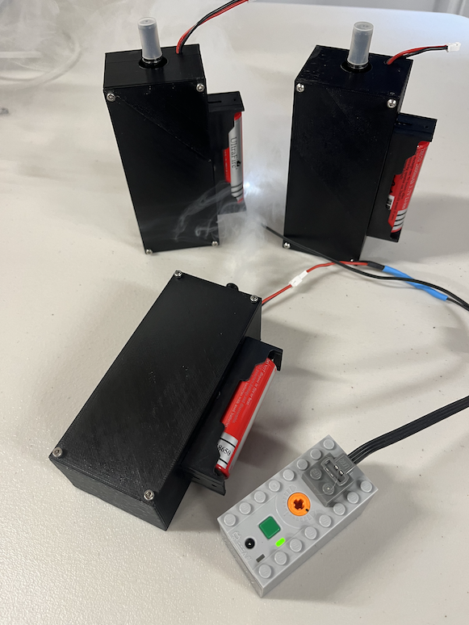

### Parts
Here are the parts and equipment you need for this project. You can get the parts from anywhere, links to in stock sources at the time of writing have been included for ease. Note, do not substitute the eSIG, or FET without proper analysis to select appropriate replacement components by someone capable of circuit design.  

You will also need several basic tools such as wire strippers, pliers, a soldering iron with solder, super glue, a clamp, screw driver with small hex heads (ie 2 and 1.5). Walk through the instructions below for details of what will have to be done.

The 3D enclosure parts to be printed can be found [here](./3D/).

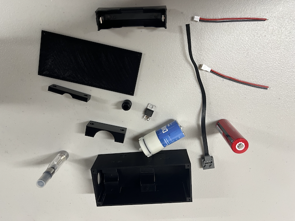

| Item | QTY | Example Link to Source |
|----------|----------|-------|
| Kanger Tech T2 Ego eSig |	2 |	[Vaping Zone](https://www.vapingzone.com/kangertech-t2-ego-clearomizer-single-pc.html) |
| Fog juice	| 1	| [Amazon](https://www.amazon.com/FogWorx-Extreme-High-Density-Juice/dp/B0777S56RB/ref=sr_1_5?dchild=1&keywords=fog+juice&qid=1593553743&sr=8-5) |
| Air Pumps W/Tubing | 1 | [Amazon](https://www.amazon.com/gp/product/B06Y2CXZ67/ref=ppx_yo_dt_b_search_asin_title?ie=UTF8&psc=1) |
| 18650 Batteries W/Charger	| 1 |	[Walmart](https://www.walmart.com/ip/EBL-4-Pack-3000mAh-3-7V-Rechargeable-Batteries-Battery-Charger-for-Li-ion-18650-18500-14500-Replacement-Battery/148568497) |
| 18650 Battery Holder | 1 | [Digikey](https://www.digikey.com/en/products/detail/mpd-memory-protection-devices/BH-18650-PC/3029216)
| Wire |	1 |	[Amazon](https://www.amazon.com/Electrical-Flexible-Silicone-different-automotive/dp/B07G744V5Z/ref=sr_1_5?dchild=1&keywords=wire&qid=1593557372&sr=8-5) |
| JST-PH 2.0 Male and Female | 1 | [Amazon](https://www.amazon.com/Upgraded-Connector-Battery-Inductrix-Eachine/dp/B07NWD5NTN) |
| Shrink Tubing	| 1	| [Amazon](https://www.amazon.com/650pcs-Shrink-Tubing-innhom-Approved/dp/B07WWWPR2X/ref=sr_1_8?dchild=1&keywords=shrink+tubing&qid=1593557287&sr=8-8) |
| FET (FDP8896-ND)	| 1	| [Digikey](https://www.digikey.com/en/products/detail/onsemi/FDP8896/978997) |
| Resistor (10K) |	1 |	[Digikey](https://www.digikey.com/product-detail/en/stackpole-electronics-inc/CF14JT10K0/CF14JT10K0CT-ND/1830374) |
| Diode (P600M-E3-54GICT-ND) |	1 |	[Digikey](https://www.digikey.com/product-detail/en/vishay-semiconductor-diodes-division/P600M-E3-54/P600M-E3-54GICT-ND/3025895) |
| M2.5 Screw Set | 1| [Amazon](https://www.amazon.com/HVAZI-Metric-Stainless-Button-Assortment/dp/B076ZN18KZ/) |
| Optional Lego LED activator | 1 | [Amazon](https://www.amazon.com/LEGO-Functions-Power-Light-8870/dp/B003TZP4D6) |

### eSig Preperation
This section will walk you through modifying the eSig and connecting the wires needed to drive the coil in it. Originally the T2 is designed to connect to a controller that applies power to it. We are making our own controller in substitution of this. 

**Step 1**
- Remove the eSig center post by gently, but firmply pulling it out with a set of fine nose pliers.

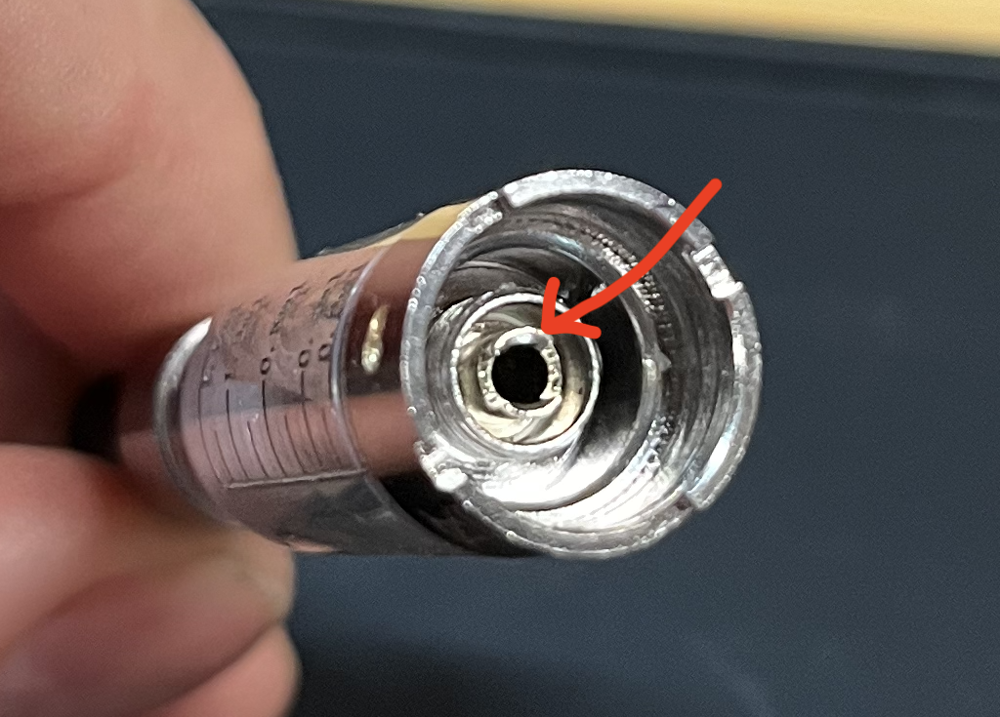

**Step 2**
- Route a wire through the 3D printed part using the hole the opposite side as the channeled grove. Then strip and solder that end of the wire to the center post of the eSig previously removed. Be sure to solder the wire to the INSIDE of the center post so as to minimize any possible short circuit.

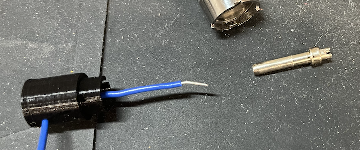

**Step 3**
- Route a wire through the other hole and up to and through the grove. Strip the wire back enough to allow for 2-3 turns or wraps of the wire around the circumfrence of the 3D printed part.

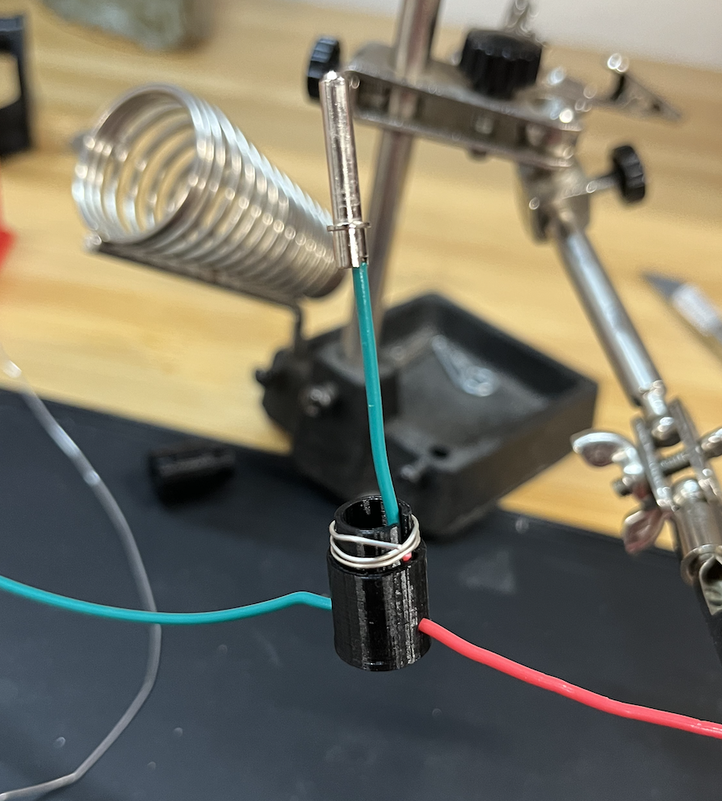

**Step 4**
- Carefully place the center post back into the eSig being sure to pull excess wire out through the 3D printed part. Ensure that the center post is firmly seated back into the eSig and that no excess solder is allowed to contact the adjacent surfaces.

    - Do not let the solder or un-insulated part of the wire touch the outside ring or base, only the middle post. The middle post is one contact of the coil while the outside ring is another. If you do short them, when you turn your smoker on your wires will get very hot and components will be destroyed. 
    - If you are unsure you can use a multimeter to measure the resistance between the wire and the ring. It should be 1.8 ohms or above. If it's lower, you most likely have a short.

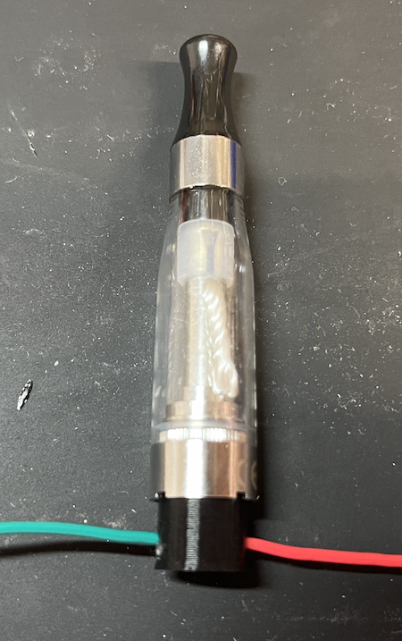

**Step 5**
The pump has a red dot next to it's positive terminal
- IMPORTANT
  - The diode MUST be put on in the right direction. The silver line must be pointing to the positive side.
  - Make sure the metal terminals do not contact the metal casing.
  - If this is put on backwards you will get a nice pop out of the diode as it heats up to red hot conditions. 
- Solder wire leads to the pump noting that the red mark is for the Positive side of the connection. 
- Here it is recommended to place a small amount of fog juice into the eSig and test that both the pump and eSig are functional by conencting their repsective wire leads to a charged 18650 battery.
- If everything is operational then it is time to apply a small amount of super glue to both ends of the 3D printed part ensuring adhesion to both the pump and eSig. It is recommended to use a clamp to hold everything in place and then to apply the small amoutn of glue necassary. After drying then rotate the assembly in the clamp to apply glue to the other side.

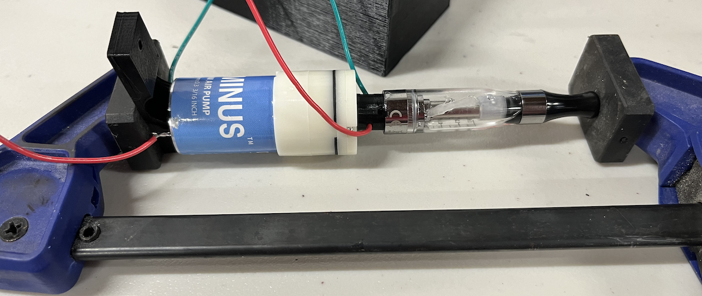

**Step 6**
- Carefully place the eSig and pump assembly into the craddle of the enclosure.
- Using ~10mm length M2.5 screws tighten the respective pump and eSig straps to the enclosure ensuring to tighten only as necassary such that the pump and eSig assembly cannot move (especially slide up and down) within the craddle. 

**Step 7**
- Pepare the FET by sodlering wire leads to each of the 3 legs noting the color chosen with respect to the pin mapped on the FET.  

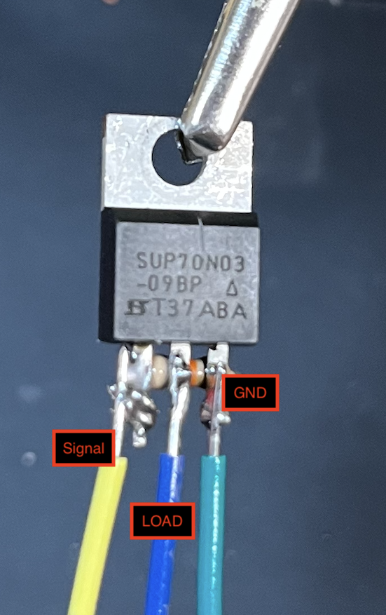

**Step 8**
- Remember when connecting things to put the heat-shrink on the wire before soldering so you can slide it down and heat it up to secure it. If you forget, you will have to pull the wire off and re-solder it all over again.

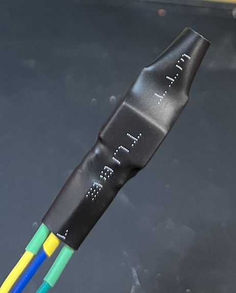

Congratulations, your eSig and pump assembly are ready for the electrical assembly into the enclosure.

### Final Assembly

**Step 1**
- Route the small female side of 2 pin JST wire through the small hole provided in the top of the enclosure. Solder on an additional wire lead to both ends to make the subsequent steps easier.

**Step 2**
- Solder on sufficient wire leads to the battery holder, being careful to note the POSITIVE and GND side. Route the wires leads through the holes provided on the enclosure to the inside of the box again noting the polarity alignment such that they match the '+' and '-' sides embossed into the printed enclosure.
- Using a pair of flat head screws and bolts securly tighten the battery holder to the enclosure.

**Step 3**
- Using some small wire connectors connect all of the wires up in the following way.
    - Red line of the JST input line to the Signal side of the FET
    - The POSITIVE side of the pump and a side of the eSig to the POSITVE side of the battery.
    - The GND side of the battery, the black side of the JST input line, the GND side of the FET
    - The Load side of the FET to the GND side of the pump and remaining eSig side.

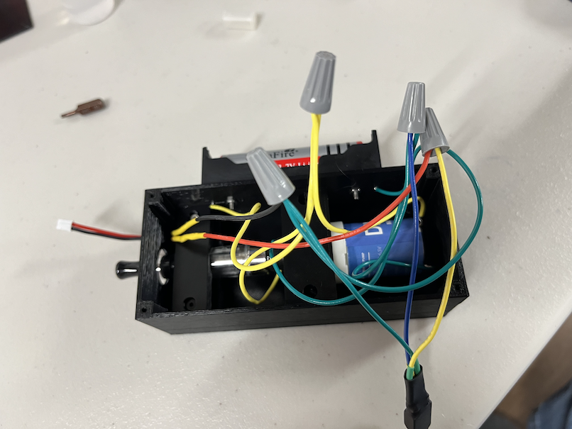

**Step 4**
- Test it out to ensure that it runs properly. If everything is good then remove the wire connectors one at a time and solder together the wire bundle. Then heat shrink each wire end to prevent wire ends from creating a short circuit.

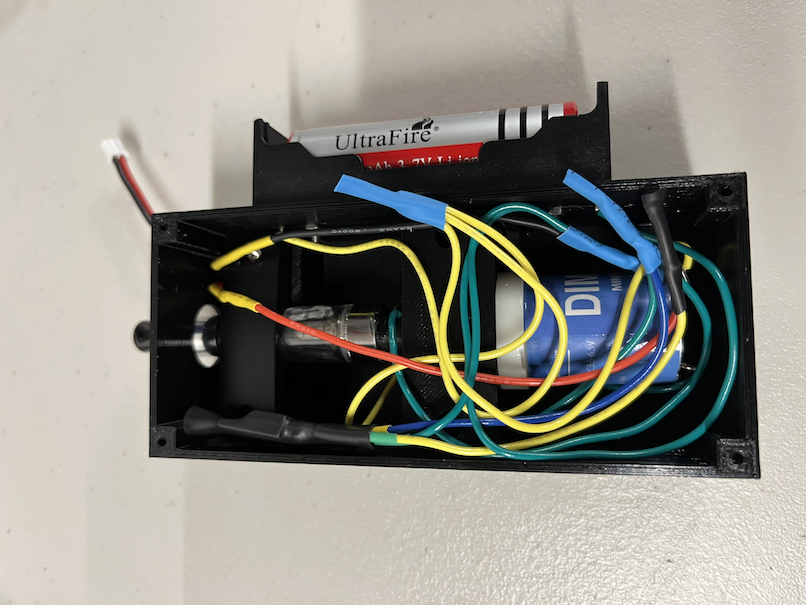

Wiring is now done! Congratulations!

**Step 5**
- Almost done. Carefully route the wires into the enclosure so that the lid can be seated flush to the top of the enclosure.
- Using ~6mm length screws attach the lid in the 4 corners and enjoy.

**Step 6**
- Modify the eSig end to acepct 3/16" tubing and or a [Lego Technic Pin](https://www.bricklink.com/v2/catalog/catalogitem.page?P=2780#T=C) 
using a Dremel or similar tool etch away a small amount of material.

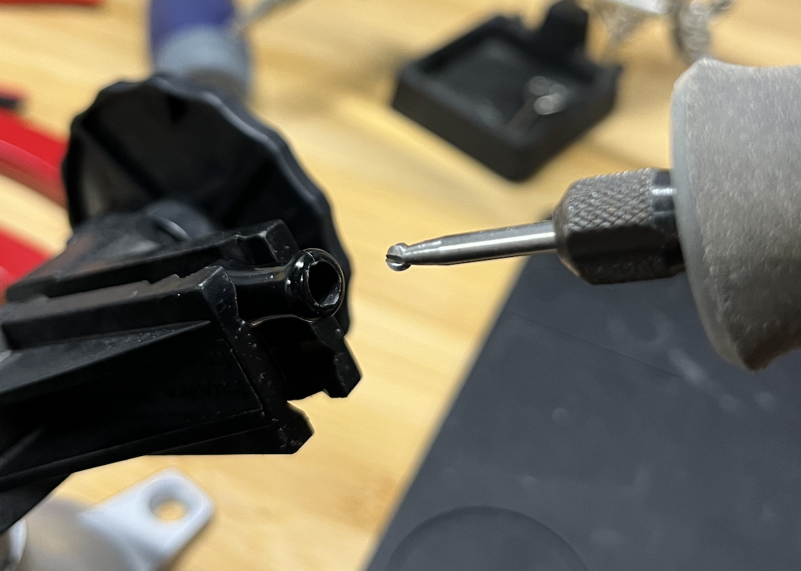
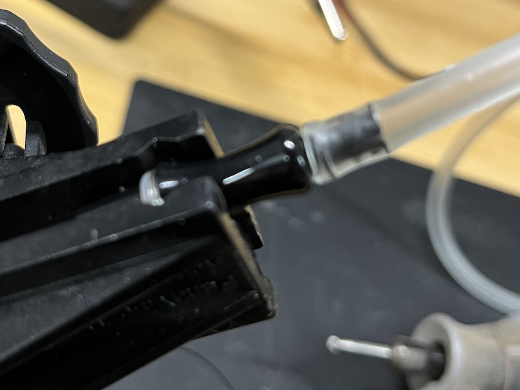

### Lego Integration

The smoker can be triggered by any external circuit, however it was always designed to complement the Bricks in the Air Lego kits and as such intended to be triggered or activated by a Lego Power Functions LED attachemnt. The following steps outline how to modify the Lego Power Functions LED to trigger the smoker.

**Step 1**
- Cut a single LED off of the wire and strip back the insulation to expose the wire.
- Plug the LEG into a LEGO battery pack and turn on the batter pack. Ensure that the exposed wires do not touch and create and short circuit.
- Using a multimeter connect the ends to the exposed wire leads to determine the POSITVE and GND side of the wire leads.
- Pre position heat shrink tubing (2 samller ones for each wire and 1 larger one for both) to the LED wire.
- Solder the BLACK JST-PH 2.0 Male side to GND and the RED JST-PH 2.0 Male to the POSITIVE.
- Heat up the heat shrink material to protect the recently soldered connections.
- Plug the modified wire into a LEGO battery pack and also into the smoker. Turn the battery On/Off to ensure that the LED illuminates AND activates the attached smoker.

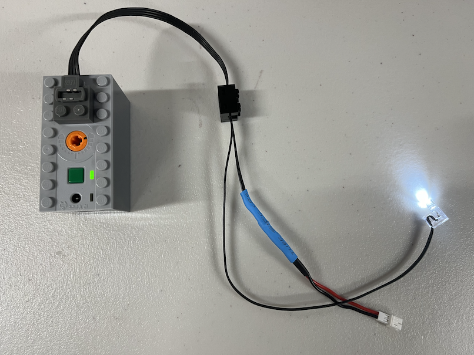
